# FeedForward

[](https://github.com/emanuelefrancescorestivo/FeedForward/actions/workflows/tests.yml)

**A weekly meal plan that fits a student budget at your own supermarket,
and shows the science behind every food on it.**

You give your age, height, weight, how active you are, one goal (energy,
focus, sleep, iron…), where you shop and what you can spend. FeedForward plans
seven days of breakfasts, lunches and dinners that cover your needs, prices the
shopping list at that shop from real receipts, and can explain every choice as
a path: *food → nutrient → goal*, backed by EU-authorised health claims.

> Example: 24-year-old man, 178 cm, 72 kg, light activity, goal "focus",
> €50 at Lidl → a week for **€39.33**, 2,357 kcal a day, every tracked vitamin
> and mineral at 97 % or more except vitamin D (81 %). A 90 kg student-athlete
> training hard (≈ 3,800 kcal a day) gets bigger plates and three snacks a day
> for €53.57. The same week is not possible for €20 at Naturalia, and the app
> says so, with the minimum budget it would take, instead of planning less food.

<p align="center">
  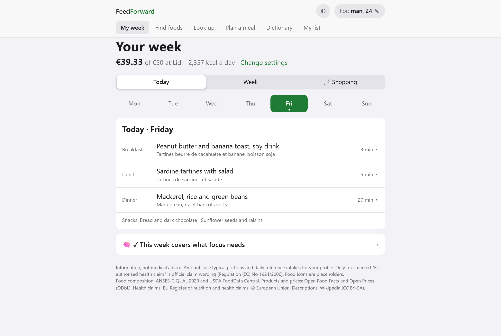
  &nbsp;
  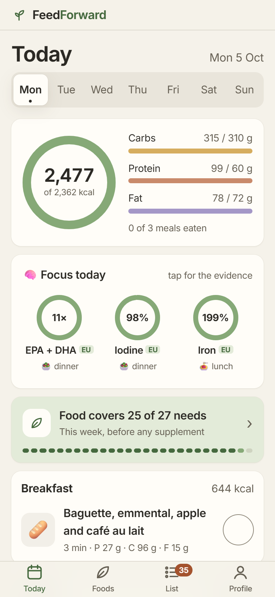
</p>

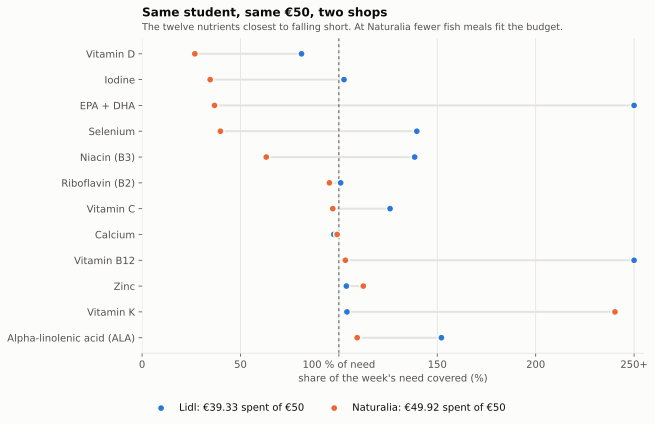

The shop changes what the same money buys. The planner never trades energy for
budget: below the cheapest week that feeds you enough, it says so and gives that
figure. Here it is for every chain in the price data:

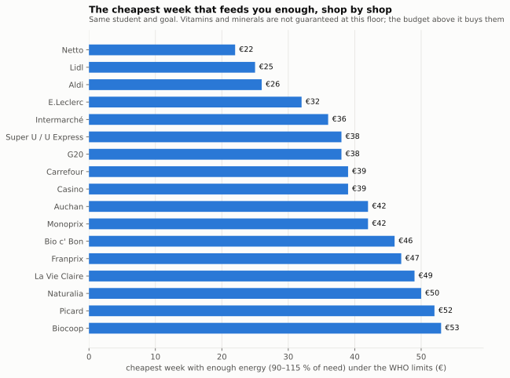

Every figure in this README is computed by the engine: `python scripts/figures.py`
(from `backend/`) redraws them and prints each number they show.

---

## Why I built this

I'm a student interested in sports science, neuroscience and what people call
biohacking. For me that mostly means the unglamorous basics (food, training and
sleep) and how they work *together* to keep energy high and the mind sharp, in
lectures, in training and everywhere else. I use these ideas on my own
"hardware" every day, and I want to make them simple, practical and affordable
for the people around me: hybrid student-athletes, or anyone who is simply
curious.

The idea came while studying graph algorithms (TAOCP2 at PSL): a food reaches a
goal through the nutrients it carries, and that is a path in a graph. Make the
path explicit, and an app can show *why* a food helps instead of just asserting
it. FeedForward started there, and grew into the question students actually ask
on a Sunday evening: *what do I buy and cook this week, with this budget, at my
supermarket?*

This repository is the nutrition part of that picture. Training enters through
activity level (energy and protein needs); sleep is one of the goals, although
the evidence linking specific nutrients to sleep is still thin, and the app
says so.

---

## What's inside

| Area | What it shows | Where |
|---|---|---|
| **Data engineering** | Five public sources (ANSES-CIQUAL, USDA FoodData Central, Open Food Facts, Open Prices, the EU health-claims register) merged through one nutrient ontology: 36 nutrients, INFOODS tags, IT/EN/FR aliases, unit conversion that refuses to guess (IU for vitamins A and E), provenance on every value | [`ontology/`](backend/feedforward/ontology/), [`data/ingest/`](backend/feedforward/data/ingest/) |
| **Graph algorithms** | Food → Nutrient → Goal graph with edge cost −log(strength), so Dijkstra's shortest path is the strongest evidence chain; Yen for the next routes; reverse Dijkstra from each goal: **587 ms → 0.7 ms** per query | [`engine/graph.py`](backend/feedforward/engine/graph.py), [`engine/algorithms.py`](backend/feedforward/engine/algorithms.py) |
| **Optimisation** | Two mixed-integer programs (PuLP/CBC): one meal that covers a goal, and a whole week under a budget, with energy as a hard constraint and WHO limits on salt, saturated fat and free sugars | [`engine/week_planner.py`](backend/feedforward/engine/week_planner.py), [`engine/meal_optimizer.py`](backend/feedforward/engine/meal_optimizer.py) |
| **Statistics on messy data** | Crowdsourced receipts → median €/kg per chain, outliers dropped, chains with few receipts shrunk towards national median × chain price index; the index comes out of the data (Lidl 0.67, Carrefour 1.06, Biocoop 1.49) | [`data/ingest/prices.py`](backend/feedforward/data/ingest/prices.py) |
| **Scientific judgement** | Scoring per realistic portion against reference intakes; heme vs non-heme iron; the EU register as evidence layer (118 authorised links, 62 EFSA rejections removed); no medical conditions collected, on purpose (EU medical-device rules) | [`docs/SCIENTIFIC_BASIS.md`](docs/SCIENTIFIC_BASIS.md) |
| **Design choices** | Thirty-one decisions with their alternatives and costs: −log edge costs, portion scoring, the EU register as evidence, energy as a hard constraint, robust price statistics… | [`DECISIONS.md`](DECISIONS.md) |
| **Engineering** | FastAPI + SQLAlchemy/Alembic; a web app with no build step (progressive disclosure, dark mode, works on phones); 358 tests on GitHub Actions, 30 of them driving the app in a browser (Playwright), and one that walks the input space (small to athlete-sized needs, every diet and kitchen, cheapest and dearest shops) | [`backend/tests/`](backend/tests/), [`.github/workflows/`](.github/workflows/) |

Two bugs the tests caught, as examples of how the project is checked:

- **A library upgrade.** Running the suite from a fresh clone installed PuLP 4,
  which no longer bundles the CBC solver and reports "stopped within the
  optimality gap" as its own status. Valid plans came back as "impossible".
  All solver calls now go through one adapter ([`engine/milp.py`](backend/feedforward/engine/milp.py))
  that works with PuLP 3 and 4, with a test of its own.
- **A diet filter checked against ground truth.** A test that runs the
  vegetarian filter over every food CIQUAL files under meat, fish and seafood
  found five seafoods passing as vegetarian, and showed that tofu and seitan
  (CIQUAL's "meat substitute" group) were being treated as meat, so their iron
  counted as the better-absorbed heme iron. Both are fixed, and "animal flesh"
  (heme iron) and "animal-derived" (preformed vitamin A) are now two separate
  properties.

---

## Try it

```bash
cd backend
pip install -r requirements.txt
uvicorn feedforward.api.main:app --reload
# → the app:            http://localhost:8000/app
# → interactive API:    http://localhost:8000/docs
pytest -q               # the test suite
```

The first start builds the engine (a few seconds). The app opens on a sign-in
page. On your own machine a **test sign-in** asks only for a name (the same name
brings back the same account), so you can try it as a new person at once; it is
off in production (`FEEDFORWARD_ENV=production`) or with `FEEDFORWARD_DEV_LOGIN=0`.

### Sign in with Google

1. In [Google Cloud Console](https://console.cloud.google.com/apis/credentials),
   create a project, then **Create credentials › OAuth client ID**, type
   **Web application** (the consent screen asks for an app name and your email).
2. Under **Authorised JavaScript origins** add `http://localhost:8000` (and your
   real domain later). No redirect URI is needed.
3. Copy the client ID (`….apps.googleusercontent.com`; it is public, not a
   secret) and start the server with it:
   ```bash
   FEEDFORWARD_GOOGLE_CLIENT_ID=….apps.googleusercontent.com uvicorn feedforward.api.main:app --reload
   ```
   (PowerShell: `$env:FEEDFORWARD_GOOGLE_CLIENT_ID="…"` on the line before.)

The button then appears on the sign-in page. The server checks each Google ID
token (Google's signature, this client ID as audience, a verified email) and
creates the account on first sign-in. What a person keeps in the app (answers,
diary, list) is stored in their account (`/me/state`); Profile has
"Download my data" and "Delete my account".

---

## How it works

> A calorie counter says "spinach contains 2.7 mg of iron." That number is
> almost meaningless on its own: plant (non-heme) iron is absorbed at 2–20%, and
> that rate can *triple* in the presence of vitamin C. FeedForward reasons about
> exactly this — the interactions, the bioavailability, and the strength of the
> underlying science.

### Architecture

```
User surfaces      Web app (/app) · Expo mobile prototype
        │
Backend            FastAPI · SQLAlchemy + Alembic (PostgreSQL; SQLite in tests) · JWT
        │
Scientific Engine  Graph (Dijkstra · Yen) · MILP (PuLP/CBC) · Bioavailability · Evidence
        │
Data               CIQUAL · USDA FoodData · Open Food Facts · Open Prices ·
                   EU health-claims register · PubMed · curated ontology
```

The engine is plain Python with no web or database dependency; the API and the
web app are thin layers on top of it.

### The graph
A tripartite weighted graph: **Food → Nutrient → Goal**. Every edge has a
strength in (0, 1] and a cost of `-log(strength)`, so a path's strength is the
product of its edges and Dijkstra's *shortest* path is exactly the *strongest*
food → nutrient → goal chain; Yen's k-shortest-paths gives the next-strongest
routes. The graph is hand-written (no NetworkX backing store); NetworkX is used
only for offline analytics.

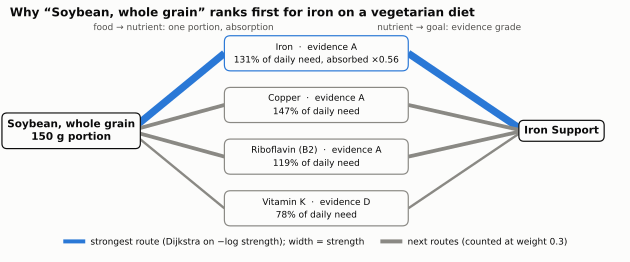

### Scoring (v1.3) — [`engine/scoring.py`](backend/feedforward/engine/scoring.py)
- **Food → Nutrient** = what **one realistic portion** delivers as a share of
  daily need (DRI), adjusted for chemical form (heme vs non-heme iron) and strong
  intrinsic inhibitors (oxalate on calcium), saturating so the tenth day's worth
  adds almost nothing. Portions are data ([`data/portions.json`](backend/feedforward/data/portions.json)):
  2 g of baking powder, 30 g of nuts, 150 g of cooked lentils. A portion over a
  Tolerable Upper Intake Level is discounted.
- **Nutrient → Goal** = association weight × evidence grade.
- **Food → Goal** = strongest route in full plus the next 3 routes at weight
  0.3 (noisy-OR), times penalties for sodium / saturated fat / sugars per
  portion (stronger where the goal has a negative edge, e.g. sodium → blood
  pressure) and for exceeding a UL.
- **Enhancers are not routes.** Vitamin C helps iron *absorption*; it is applied
  in meals and suggested as a pairing, so a vitamin C drink no longer ranks as an
  iron source.

Results are diversified (one entry per food family, a cap per food group), and
default recommendations exclude infant foods, supplements (fish oils), products
not sold in the EU (marine mammals) and foods unsafe as listed (raw pokeweed,
raw taro leaves). `python -m feedforward.engine.benchmark -v` scores the
rankings against a sanity benchmark ([`data/benchmark_goals.json`](backend/feedforward/data/benchmark_goals.json)):
v1.2 → v1.3 mean top-20 hit rate 0.31 → 0.68, implausible results 34 → 3.

### Knowledge layer (v1.4) — EU health claims
Nutrient → goal edges come from the **EU Register of authorised health claims**
([`data/ingest/eu_claims.py`](backend/feedforward/data/ingest/eu_claims.py)):
118 authorised edges (grade A, official wording, EFSA opinion cited) and 62
associations EFSA found unsubstantiated, which no longer count (e.g. vitamin E →
heart health). B vitamins, choline, iodine and EPA+DHA were added to the corpus
so that energy, mood and cognition claims reach foods. See
[`docs/SCIENTIFIC_BASIS.md`](docs/SCIENTIFIC_BASIS.md#eu-health-claims-v14--the-knowledge-layer).
Sanity benchmark on the EU-grounded engine: 0.68 mean top-20 hit rate (v2 lists, everyday foods first), 0 implausible results.

### The app: Today, Foods, List, Profile
`http://localhost:8000/app` (this is the `dashboard-ui` branch; `main` has the
earlier three-section version). The layout follows the conventions of diary-style
nutrition apps; what sits inside is FeedForward's own:

- **Sign-in and two screens.** Google (or the local test sign-in), then about
  you, and one goal with the diet (anything, vegetarian, vegan). Today opens at
  once. The other questions (cooking time, training, sleep, study, energy dips,
  morning hunger, foods you don't eat, batch cooking, kitchen) arrive on Today
  one card at a time, all optional; an answer that turns a strategy on shows it
  there with its evidence grade, the answer behind it, its PubMed sources and a
  switch to turn it off. The energy goal (keep steady, lose a little, gain a
  little, with the safety limits) and every other answer are in Profile.
- **Day one is not empty:** until something is logged, the meal of the moment
  (breakfast, lunch or dinner by the time of day) shows one idea with its
  reasons, "I'll have this" and "More ideas"; it can be hidden for good.
- **Today** is a diary. Each meal has **+ Add**: search a food or a recipe (its
  usual portion is filled in), repeat an earlier meal in one tap ("Same as
  Monday's dinner"), log the **CROUS meal** (a main and two sides, about 590 kcal,
  always marked ≈ as an estimate; vegetarians and vegans get a lentil plate of
  their own, about 640 and 650 kcal), or tick several recent items and add them
  together. Each log is saved on its own (`/diary/entries`), so two devices
  never overwrite each other, and a log that could not be saved stays on screen
  as "Not saved" with Retry. And **Ideas**: three recipes for that
  meal, ranked by what they add to the needs still open today (the goal's
  nutrients first), the energy that fits the meal and the strategies for it,
  each with its reasons ("Magnesium 32%", "Carb-rich, for your evenings · C").
  Strategies show as chips on their meal, with the evidence one tap away. The
  ring shows energy **eaten** against the day's target, a level to reach, not a
  cap: there is no "calories left" and nothing turns red. A card shows the
  goal's nutrients so far, with the meal each mostly comes from and an **EU**
  badge where an authorised claim backs the link (evidence A to C only).
- **A planned week, if you ask** (Today › "Plan a whole week?"): choose a shop
  and a budget and get seven days with
  **Food first** (how many of the week's needs food already covers, and an
  honest note on the ones still short: vitamin D comes mostly from sunlight; B12
  on a vegan diet needs a supplement or fortified foods). A meal opens a sheet
  with **Recipe**, **Why** (below) and **Swap**, which offers up to three meals
  that keep the week's budget, energy band and limits. Ticking a meal logs it in
  the diary.
- **Foods**: one search for foods and nutrients above the goal tiles; 5 everyday
  foods at a time, "Why?" with the food → nutrient → goal graph, food pages and
  the nutrient dictionary open inside it.
- **List**: starts empty and holds only what you put on it: items you type,
  foods ("+ List"), a recipe's ingredients ("+ Ingredients to list", amounts
  added up), and a planned week's shopping if you add it (ticked off in the
  shop or marked **at home**; "Plan around them" re-plans with those
  ingredients free).
- **Profile**: every answer, one tap to change it; shop and budget for a
  planned week; food-suggestion switches (low salt, low sugar, show the
  science); theme; download my data, delete my account; sources.

**Preferences.** The planner can ask about sleep, training, mornings, study,
foods you don't eat and how long you can cook (`GET /plan/questions`). Answers
turn on strategies, each shown with its evidence grade (A to C) and its PubMed
sources, which you accept or decline (`POST /plan/strategies`); the plan reports
on how many days of the week each one is met, and needs come first: the week
is planned for your needs, and strategies only shape what is left. You can also
pick an energy goal: keep level, a light deficit (−15 %) or a light surplus
(+10 %); not under 18, not in pregnancy or breastfeeding, and no deficit under
a BMI of 18.5. The week's energy never goes below resting energy, and a deficit
week is never planned more than 18 % below maintenance; in a deficit week the
planner moves meals and snacks between days so that no day falls below resting
energy where the recipes allow, and the plan counts any day left below. When your filters leave too few recipes for a
meal, the plan says what to relax (a longer cooking time, a food allowed again,
batch cooking). The questions reach the app as cards on Today (above).

The look: earthy pastels on oat and cream, one typeface (Inter, served by the
app itself so the page makes no request to a font CDN), a sidebar on desktop
and a tab bar on phones, quiet motion that switches off with the system's
"reduce motion". Every text colour passes WCAG AA in both themes, and the
meaningful graphics (rings, outlines) pass 3:1 (`docs/design/contrast.py`, run by
the tests). Icons are line drawings, not emoji. Food is shown with open-licence
photos of a similar dish from Wikimedia Commons, served by the app; a recipe's
photo is credited under it, and every photo (food thumbnails included) in
"Sources and licences" › Photo credits (`data/photos.json`). Answers are read the way people type
them: "1,78 m", "5'10", "160 lb" or "€50" all work. The design system and the
screens planned for the next releases are in
[`docs/DESIGN_SYSTEM.md`](docs/DESIGN_SYSTEM.md).

<p align="center">
  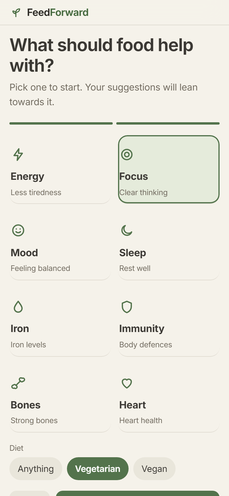
  &nbsp;
  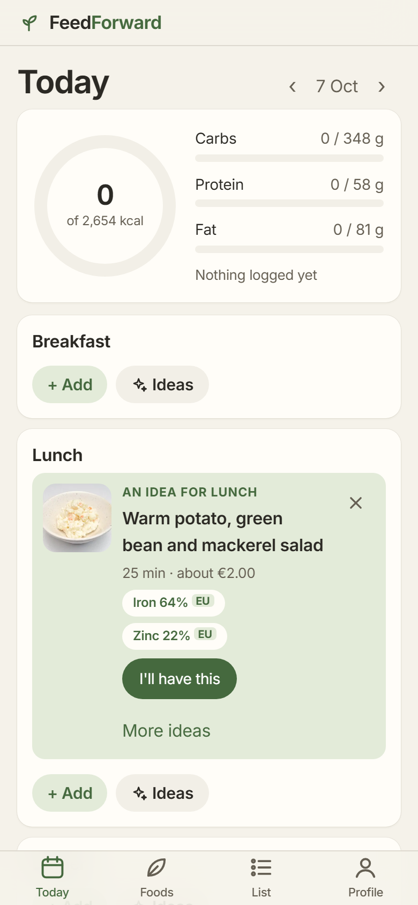
  &nbsp;
  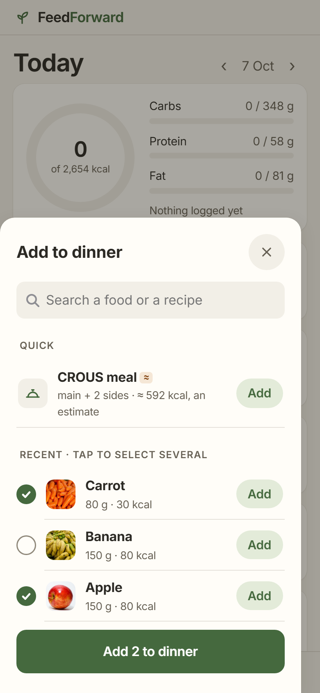
  &nbsp;
  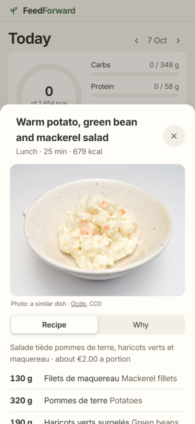
</p>

<p align="center">
  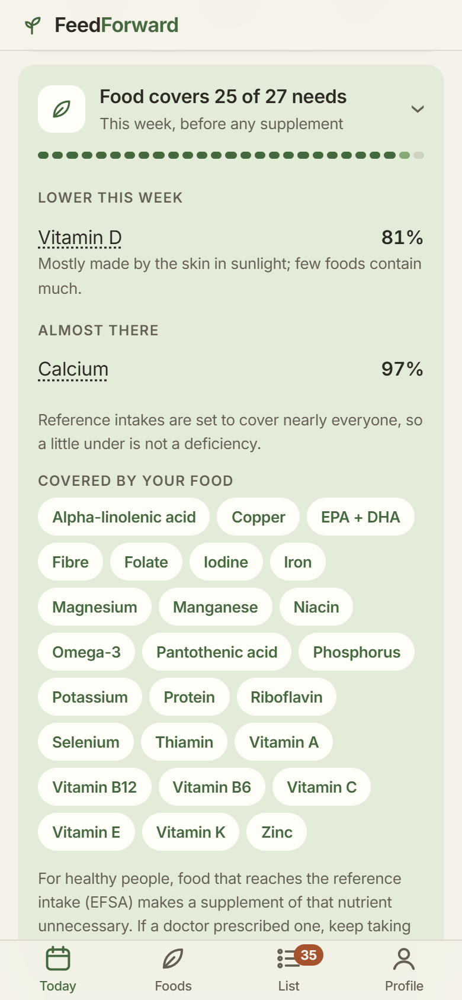
  &nbsp;
  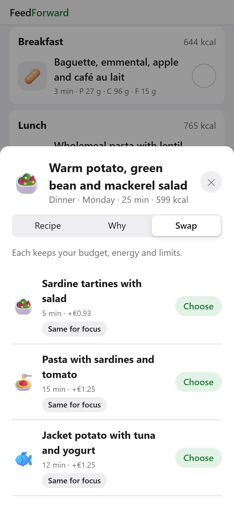
  &nbsp;
  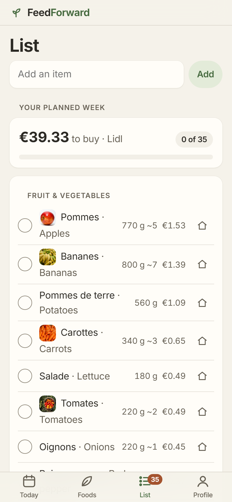
  &nbsp;
  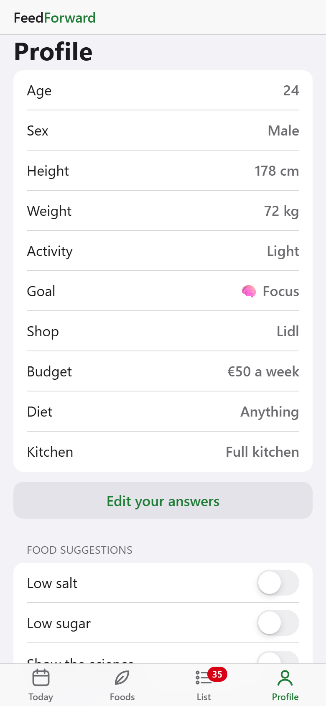
</p>

<p align="center">
  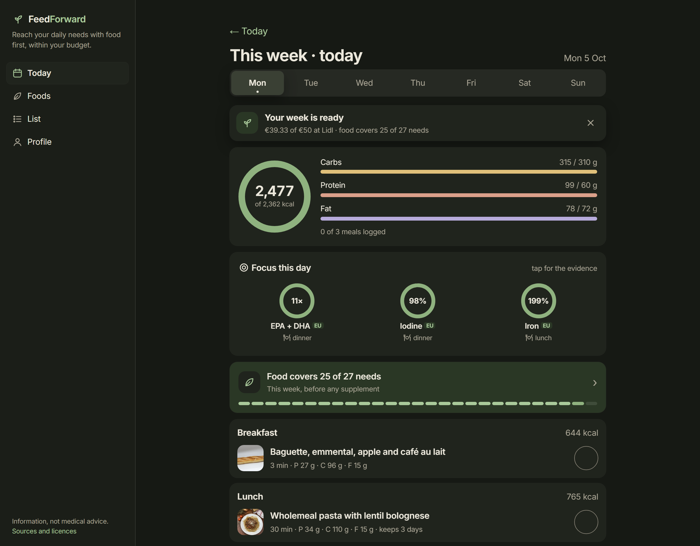
</p>

The **dictionary**
(`/dictionary/*`, [`feedforward/dictionary/`](backend/feedforward/dictionary/))
builds every entry from a named source: nutrients from the EU claim wording,
EFSA rejections, DRIs and computed everyday sources; foods from our data plus
an attributed Wikipedia summary (cached in `data/wikipedia_cache.json`); terms
from `data/glossary.json` (draft, awaiting dietitian review).

### My week — a budgeted plan for Paris / France (prototype)
Optional, from Today › "Plan a whole week?". Your answers (age, sex, height,
weight, activity, goal, diet and the rest) come from your profile; you add a
shop and a weekly budget, and get 7 days of breakfast, lunch and dinner
(+ snacks), and a shopping list priced at that shop.

- **Food composition:** ANSES-CIQUAL 2020 (3,185 French foods, Licence Ouverte),
  [`data/ingest/ciqual.py`](backend/feedforward/data/ingest/ciqual.py); energy
  computed with EU 1169/2011 factors where CIQUAL has none.
- **Prices:** Open Prices receipts (ODbL), median €/kg per chain over 30 months,
  outliers beyond 3× the national median dropped, chains with few receipts
  pulled towards national median × chain price index; missing chains estimated
  (shown with ≈). [`data/ingest/prices.py`](backend/feedforward/data/ingest/prices.py).
  Price index, from the data: Netto 0.57, Lidl 0.67, Aldi 0.70, Leclerc 0.93,
  Carrefour 1.06, Monoprix 1.17, Franprix 1.27, Naturalia 1.40, Biocoop 1.49.
- **Needs:** Mifflin–St Jeor × activity level; protein max(DRI, 0.83 g/kg);
  vitamins and minerals by age/sex only ([`engine/needs.py`](backend/feedforward/engine/needs.py)).
  No medical conditions are asked, on purpose.
- **Recipes:** 46 draft recipes + 6 snacks built from 57 ingredients
  ([`data/recipes.json`](backend/feedforward/data/recipes.json), status *draft*,
  to be reviewed by a dietitian), incl. vegan breakfasts and microwave-only meals.
- **Planner:** one MILP ([`engine/week_planner.py`](backend/feedforward/engine/week_planner.py)):
  energy is a hard band (90–115 % of need) and is never traded for budget; if a
  week does not fit, the answer is the minimum budget, not less food. Within the
  budget it maximises coverage of the week's needs (goal nutrients weighted up),
  under WHO limits for sodium, saturated fat and free sugars; fridge/bakery
  items are bought in whole packs, cupboard/freezer items counted by share used.
  Portions scale with the energy need (×0.4 to ×2.5) and snacks go from 2 to 4
  a day above 2,800 kcal, so plans exist from ≈ 500 to ≈ 6,000 kcal a day.
  When there is no plan, the answer says why: the budget (with the minimum),
  an energy need out of reach, or too few recipes for that diet and kitchen.
  Unknown diets, appliances or goals are errors, never silently ignored.
- **Why this meal?** The goal's nutrients one portion gives (from 15 % of the
  daily need, the EU "source" threshold), the ingredient each comes from, and
  the EU claim wording with its EFSA reference.
- **Swap and at home:** `swap_options` tries every recipe allowed for that meal
  against the whole week (deterministic, about 10 ms) and keeps those within
  budget, energy band and limits; ingredients marked at home cost nothing in
  the next plan.

  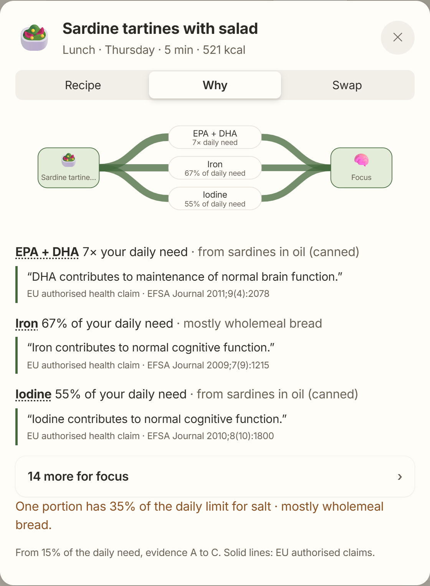
- API: `GET /plan/options`, `POST /plan/week` (with `pantry`), `POST /plan/swap-options`,
  `POST /plan/evaluate`, `GET /plan/recipes/{id}`, `GET /plan/recipes/{id}/why`.

**Checked over the input space**, not just the demo: a sweep of 531 cases
(17 shops × 3 diets × 2 kitchens × small / typical / athlete needs, budget
edges, the corners of every input range, 60 random profiles, all 28 goals)
found 188 broken answers in the first version (35 %: no plan for any athlete,
cents over budget, wrong reasons); after the fixes, none, with a median solve
of 0.1–0.7 s. A smaller version runs in the test suite.

Examples (goal "focus"): man, 24, 178 cm, 72 kg, light activity: Lidl €50 →
€39.33, 2,357 kcal/day, all needs ≥ 97 % except vitamin D (81 %); Naturalia
€50 → €49.92, fewer fish meals, so vitamin D, iodine and EPA+DHA fall to 27–37 %.
Man, 20, 190 cm, 90 kg, very active (goal "energy"): Lidl €80 → €53.57,
3,773 kcal/day, portions ×1.8 and three snacks a day.

### The latency fix
The original prototype ran Dijkstra from all ~1,800 food nodes per query (587 ms).
We reverse the graph and run Dijkstra *once from each goal*, and score every
food for every goal, once at startup. A recommendation query is then a walk
down a pre-sorted list:

```
587 ms  →  ~0.7 ms   (per cached query)
```

---

## Repository layout

```
feedforward/
├── backend/
│   ├── feedforward/
│   │   ├── engine/          # THE SCIENTIFIC ENGINE
│   │   │   ├── schema.py            # dataclasses, EvidenceGrade, NutrientForm
│   │   │   ├── graph.py             # tripartite graph + reverse index
│   │   │   ├── algorithms.py        # Dijkstra, reverse-Dijkstra, Yen, cosine
│   │   │   ├── bioavailability.py   # absorption model (the differentiator)
│   │   │   ├── evidence.py          # A–D grading, PubMed integration
│   │   │   ├── taxonomy.py          # 27 health goals, 9 body systems
│   │   │   ├── build.py             # weighting: content×absorption, assoc×evidence
│   │   │   ├── recommender.py       # orchestration + explanations
│   │   │   ├── meal_optimizer.py    # ILP meal selection (PuLP/CBC)
│   │   │   ├── needs.py             # personal energy and nutrient needs
│   │   │   └── week_planner.py      # weekly plan within a budget (MILP)
│   │   ├── ontology/        # nutrient vocabulary (INFOODS, IT/EN/FR), units, qualifiers
│   │   ├── db/              # SQLAlchemy models, seed, repository (Alembic in backend/alembic)
│   │   ├── api/             # FastAPI: routers, auth (JWT), models
│   │   ├── web/             # the web app (one HTML file, no build step)
│   │   └── data/            # corpora, edges, recipes, prices, sources.json; ingest/ rebuilds them
│   ├── scripts/figures.py   # the README's figures, computed by the engine
│   └── tests/               # pytest suite (engine + algorithms + API)
├── mobile/                  # React Native (Expo) prototype; predates the web app
│   └── src/{screens,components,api,theme}
└── docs/                    # architecture, scientific basis; APP_STORE.md is a future checklist
```

---

## Using the engine from Python

```python
from feedforward.engine import build_engine
rec = build_engine()

for r in rec.foods_for_goal("iron_support", constraints=["vegetarian"], k=3):
    e, top = r.explanation, r.explanation.contributions[0]
    print(f"{r.match:5.1f}  {r.food_name}")
    print(f"       {top['percent_of_need']:.0f}% of daily iron in {e.portion_g:.0f} g  (evidence {e.evidence})")
```

```
 74.7  Soybean, whole grain
       131% of daily iron in 150 g  (evidence A)
 79.6  Cereals ready-to-eat, wheat, puffed, fortified
       70% of daily iron in 40 g  (evidence A)
 78.7  Cereals ready-to-eat, rice, puffed, fortified
       70% of daily iron in 40 g  (evidence A)
```

Each explanation also lists every route's contribution, the penalties applied
and, for plant iron, a pairing note ("pair with a vitamin C source"): vitamin C
raises non-heme iron absorption, but it is not itself an iron source, so it is a
pairing rather than a route.

### Mobile prototype

```bash
cd mobile
npm install
npx expo start          # then press i (iOS) or a (Android)
```

---

## Status & honest limitations

This is a personal project and a working prototype, not a product in use.
Nothing here has been reviewed by a dietitian or tested with users yet.
What exists today:

- ✅ Engine: graph, bioavailability rules, evidence grading, 27-goal taxonomy, portion-based scoring, meal MILP, weekly budget planner — covered by 358 tests (pytest, run on every push by GitHub Actions, browser tests included).
- ✅ FastAPI backend: recommend / explain / meal-plan / week plan / diary (day totals, ideas per meal) / food detail / dictionary / auth (Google ID tokens, tiered access) / saved app data per account.
- ✅ Web app (`/app`): sign-in (Google, or a local test sign-in), a few questions with the strategies they turn on, Today (a diary: log a food or a recipe, ideas per meal with their reasons), an optional planned week (recipe sheet, swap), Foods (search, goals, dictionary), List (empty until you add to it), Profile; works on phones; data saved in the account. The single-meal optimiser stays in the engine and the API (`/meal-plan`), not in the interface.
- 🟡 Expo mobile prototype (`mobile/`): early screens against the recommend API; it does not have My week.

Known limitations, stated plainly:

- The bioavailability rules cover the best-established interactions (iron, calcium, fat-soluble vitamins). They are a curated subset of the literature, not exhaustive.
- Evidence grades come from the EU register (authorised claims = A) and a curated table with representative PMIDs; the live PubMed grader is implemented but off by default for reproducibility. `stress_resilience` has no nutrient with established evidence, and sleep rests on one grade-C association.
- The food corpus is ANSES-CIQUAL 2020 (3,185 foods), USDA FoodData Central (~8,000 foods, Foundation + SR Legacy), 88 curated staples and 1,809 OpenFoodFacts products whose micronutrients pass a USDA range gate. Fineli and CREA are not imported yet.
- Week planner: recipes are drafts; prices are medians of crowdsourced receipts (few receipts for some chain × ingredient pairs, marked ≈ when estimated); pack sizes are medians; vitamin D is rarely covered by food alone; vegan weeks are low in B12 and iodine by nature (the app says so); energy needs above ≈ 6,000 kcal a day (extreme height, weight and activity together) get no plan, with that reason.
- Not deployed anywhere; it runs locally. Nothing has been submitted to an app store.

See [`docs/SCIENTIFIC_BASIS.md`](docs/SCIENTIFIC_BASIS.md) for the evidence
approach and [`DECISIONS.md`](DECISIONS.md) for the design choices, the
alternatives considered and what each one costs.

---

## Provenance

FeedForward started as the final project of TAOCP2 (PSL University, Bachelor
in AI, June 2026) by **Emanuele Restivo and Marcos Almodovar**: Open Food Facts
and Wikipedia scrapers, the Food → Nutrient → Goal graph, graph-based
recommendations and an ILP vs greedy meal comparison. Since then it has been
rebuilt and extended by Emanuele Restivo: new scientific engine (bioavailability,
evidence grading, EU claims), the French data and price pipeline, the weekly
planner, an API, a web app and a mobile prototype.

**How it was built.** With an AI coding assistant (Claude Code) as a pair
programmer, and the commit history shows it. The questions, the choice of data
sources and evidence rules, and the checks are mine; each design decision, with
the alternatives and what it costs, is in [`DECISIONS.md`](DECISIONS.md).

## License

Code: MIT, see [`LICENSE`](LICENSE). The data files carry their own licences
(ODbL share-alike for anything derived from Open Food Facts / Open Prices):
see [`DATA_LICENSES.md`](DATA_LICENSES.md).
