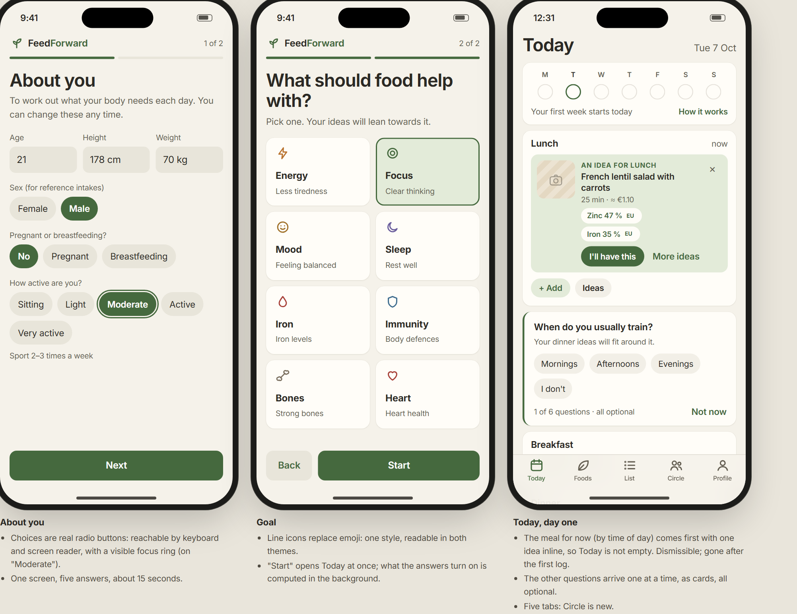

# FeedForward: design system

*October 2026. Step 3 of the next phase (see [`HANDOFF.md`](HANDOFF.md), section 6).
It extends what the web app already has (the tokens at the top of
[`web/index.html`](../backend/feedforward/web/index.html)) for the features in
[`PRODUCT_STRATEGY.md`](PRODUCT_STRATEGY.md). The screens are in
[`design/screens.html`](design/screens.html) (open it in a browser; pictures of
each section in [`design/png/`](design/png/), redrawn by `design/render.py`);
the contrast of every colour pair is checked by [`design/contrast.py`](design/contrast.py).*

---

## 1. Principles

1. **Calm.** Earthy pastels, one typeface, quiet motion. Nothing red, nothing
   that counts down, nothing that blinks for attention.
2. **Food you can picture.** Photos of food where food is shown; line icons for
   everything else; emoji only where people express themselves (reactions).
3. **Evidence one tap away.** The claim, its grade and its source are always
   reachable, never in the way.
4. **Honest marks.** An estimate says ≈, AI says AI, a stock photo says it is a
   similar dish.
5. **One system, two themes, two languages.** Every component exists in light
   and dark, in French and English, and works by keyboard and screen reader.

## 2. Tokens

### Colour

The existing palette stays. Two values are revised (they failed the contrast
check) and three pairs are new.

| Token | Light | Dark | Use |
|---|---|---|---|
| `--bg`, `--surface`, `--soft`, `--line` | as now | as now | Page, cards, fills, hairlines |
| `--text`, `--muted` | as now | as now | Text (AA on every background) |
| `--accent`, `--accent-soft`, `--on-accent` | as now | as now | Actions, "showed up", goal |
| `--ring` | **`#6d965e`** (was `#86a977`: 2.60:1) | as now | Rings and bars: now 3.35:1 on cards |
| `--control` | as now | **`#8a8578`** (was `#7d796c`: 2.92:1 on a fill) | Outlines of controls, empty day dots |
| `--note`, `--note-soft` | as now | as now | Strategy chips, estimates (≈) |
| `--gold`, `--gold-soft` | `#7a5a10` / `#f4e8cc` | `#e6c47c` / `#3a321d` | **New.** Milestones only |
| `--rest`, `--rest-soft` | `#6a5d9c` / `#ebe7f5` | `#b9addf` / `#2e2a3d` | **New.** Rest weeks and anything AI |
| `--carbs`, `--protein`, `--fat` | as now | as now | Macro bars (hidden in calm mode) |

Rules: text pairs reach 4.5:1, meaningful graphics 3:1 (`python
docs/design/contrast.py` checks 48 pairs and fails on any miss). Meaning never
rests on colour alone: a day dot is filled *and* ticked, an estimate carries
≈, AI carries the word "AI".

### Type

One typeface, Inter, served by the app. The scale, as tokens:

| Token | Size / weight | Use |
|---|---|---|
| `--t-title` | 30 / 650, −0.024em | Screen titles |
| `--t-title2` | 22 / 650 | Sheet titles, milestone |
| `--t-headline` | 17 / 600 | Card titles |
| `--t-body` | 16 / 400, line 1.55 | Default |
| `--t-sub` | 15 / 400 | Secondary text |
| `--t-foot` | 13 / 400 | Sources, captions, "from what you logged" |
| `--t-caps` | 12 / 600, uppercase, +0.06em | Group titles |
| `--t-stat` | 26 / 650, tabular | Numbers on progress tiles |

French runs 15-20 % longer than English: no fixed widths on labels, buttons
keep `white-space: nowrap` and the layout lets them wrap as a whole.

### Space, radius, depth, motion

| Kind | Tokens |
|---|---|
| Space | `--s1` 4 · `--s2` 8 · `--s3` 12 · `--s4` 16 · `--s5` 20 · `--s6` 24 px; 16 px page gutter |
| Radius | `--r-sm` 8 (tags) · `--r` 14 (cards) · `--r-lg` 18 (sheets) · 999 (pills, chips) |
| Depth | `--shadow` (cards) · `--shadow-up` (sheets, floating) · the scrim behind sheets |
| Motion | `--dur-press` 120 ms · `--dur` 200 ms (state) · `--dur-sheet` 280 ms · `--dur-draw` 800 ms (rings, once) · `--dur-moment` 600 ms (a milestone, once); one curve, `--ease` |

## 3. Icons and images

**Icons.** Line icons on a 24 px grid, 2 px stroke, round caps, drawn inline
(no icon font, no third-party request). They replace the emoji used today for
goals, meals and empty states. The set: today, foods, list, circle, profile,
sprout (streak), moon (rest week), check, camera, spark (AI), repeat, tray
(CROUS), plus, search, chevrons, bell, share, medal, pot (cooked), coin (cost),
leaves (plants), waves (calm mode), link (invite), send, and one per goal
(bolt, target, smile, moon, drop, shield, bone, heart). The bone needs a
better drawing before release.

**Photos** (owner's decision: stock and open-licence photos).

- **Where:** recipe cards and sheets, ideas, logged recipes and foods,
  shopping-list items. Not on onboarding, Progress or the recap.
- **Licences accepted:** CC0, CC BY, CC BY-SA (Wikimedia Commons), the Unsplash
  and Pexels licences. Each photo has an entry in a ledger
  (`data/photos.json`: source page, author, licence, changes made), listed in
  `DATA_LICENSES.md`. A cropped or resized CC BY-SA photo stays CC BY-SA.
- **What a photo may show:** a dish like the recipe, in natural light, from
  above or at 45°. No people, no brands or packaging, no scales, measuring
  tapes or "diet" staging.
- **Honesty:** the recipe sheet says "Photo: a similar dish · author, licence".
- **Served by the app,** like the font: resized at build time to WebP, 128 px
  square for thumbnails and 800 × 600 for sheets; nothing is loaded from the
  photo sites.
- **Alt text** names the dish ("Lentil salad with carrots"), not the photo.
- **No photo yet:** the line icon of the dish family on a soft tile, never an
  empty grey box.
- **People's own photos** (circle posts): visible to that circle only, with
  location and other EXIF data removed on upload.

## 4. Components

New components, with their states and what a screen reader hears. The existing
ones (cards, chips, grades, the EU tag, rings, sheets, segmented controls,
switches) keep their current look, with the revised tokens.

| Component | Anatomy and states | Accessibility |
|---|---|---|
| **Week strip** | 7 day dots: showed up (filled, ticked), today (ring), today and showed up (ring + fill), missed (outline), ahead (faint outline); a line "3 of 3 days · this week counts" and the streak | A list: "Monday, showed up"; the whole strip is one button to This week |
| **Streak** | Sprout icon + "6 weeks"; hidden when the person hides it | Text, no icon-only meaning |
| **Rest week** | Moon + "1 rest week saved", lavender | Text |
| **Question card** | Accent rule on the left, question, one-line why, choice chips, "1 of 6 · all optional", "Not now" | A radio group with a legend |
| **Inline idea** | Accent-soft panel in the meal card: photo, "An idea for lunch", name, time and cost, two reason chips, "I'll have this", "More ideas", dismiss | Dismiss labelled "Hide this idea" |
| **Quick add** | "Again?" rows (repeat a whole meal), the CROUS preset with ≈ | Each row one button with the full text |
| **Multi-pick** | Round tick before each recent item; a sticky "Add 2 to dinner" | Checkboxes; the button names the count |
| **Estimate tag** | "≈" in note colours, on any estimated amount | "about" read before the value |
| **AI tag** | Spark + "AI", lavender; AI surfaces use `--rest-soft` | "Made by AI from FeedForward's evidence" |
| **Amount stepper** | − value + on a soft pill | A spin button with min, max and unit |
| **Stat tile** | Caps label with icon, 26 px value, one-line detail | Read as one sentence |
| **Needs bar** | One segment per need: met (accent), close (ring at 60 %), not yet (line) | "21 of 27 needs met by food, from what you logged" |
| **Plant chips** | New plants first, accent-soft and "new" | A list |
| **Milestone medal** | Gold-soft disc with a line icon; earned (gold) or next (soft, muted), named, no countdown | "Earned in September: 10 plants in a week" |
| **Milestone sheet** | Large medal, title, one sentence, the evidence link with its grade, Share and close | Focus moves to the title; one polite announcement |
| **Recap card** | Accent-filled card: brand, week, four figures, one highlight with EU tag; the shareable unit | Text in the page, not an image; the shared image carries alt text |
| **Circle header** | Name, avatar stack (initials on four tints), "4 people · private", Invite | Avatars hidden from screen readers; the count is read |
| **Challenge bar** | One bar for the whole circle, "22 of 30", "all 4 joined" | A progress bar with its label |
| **Cook-together card** | Photo, day and proposer, recipe, who is in, "I'm in" | The button says what it does: "I'm in for Thursday dinner" |
| **Post** | Avatar, "Léo cooked", recipe and time, the photo, reactions, Recipe link | The photo's alt text is the recipe name unless the author writes one |
| **Reaction** | Emoji + count on a pill; mine has an accent outline | A toggle button: "Yum, 3, pressed" |
| **Ask thread** | Question bubble (accent), answer (soft) with AI tag, quoted claims with reference and grade, an input with send | The answer region is live; claims are block quotes |
| **Tab bar** | Five tabs: Today, Foods, List, Circle, Profile | Tabs with names, current one marked |

**Calm mode** changes components, not screens: the energy ring counts meals
("2 meals logged"), macro bars disappear, goal nutrients read "reached" or "on
its way" with a tick or a sprout, kcal leaves every row, ideas and stats keep
everything else.

## 5. Motion

| Moment | Motion | Duration |
|---|---|---|
| Press | Scale to 0.96 | 120 ms |
| Sheet | Rises from the bottom (phones), fades in (desktop) | 280 ms in, 200 ms out |
| Ring and bars | Draw from zero the first time a day is opened, then still | 800 ms |
| A tick (logged, showed up) | Pop | 300 ms |
| A milestone | The medal settles in once | 600 ms |

No confetti, no loops, no shaking for a missed goal (shake is kept only for an
invalid form). With "reduce motion", every one of these is off.

## 6. Accessibility (WCAG 2.2 AA)

- Every control is a real control: the onboarding chips become visible radio
  inputs (today they are `display: none`, which hides them from keyboards and
  screen readers).
- Visible focus everywhere (2 px accent outline, 2 px offset).
- Targets: 44 px for primary actions; inline chips and links at least 32 px
  high with spacing, above the 24 px minimum of WCAG 2.2 (2.5.8).
- Rings and bars are images with a label ("Iron, 54 % of today's need");
  their numbers are also in text.
- Usable at 200 % text size; nothing is cut, cards grow.
- `lang="fr"` or `lang="en"` on the page, following the person's choice.
- Checked automatically: axe-core runs in the Playwright screenshot script
  and fails on any serious violation.

## 7. Words

Plain and warm, in both languages. A short guide:

| Say | Don't say |
|---|---|
| "An idea for lunch" | "You should eat" |
| "On its way", "reached" | "Too low", "deficit", "over" |
| "A new run starts whenever you like" | "You lost your streak" |
| "From what you logged" | "You ate only…" |
| "Photo: a similar dish" | (nothing) |
| "Questions about a health condition: please ask a doctor or dietitian" | Any advice about a condition |

Never: good or bad foods, "cheat", "guilt", "clean", "burn it off".

Key terms in French: Today → Aujourd'hui · Ideas → Idées · Circle → Cercle ·
This week → Cette semaine · Rest week → Semaine de repos · Calm mode → Mode
calme · Your week in food → Ta semaine dans l'assiette · CROUS meal → Repas
CROUS (plat + 2 périphériques, the official wording).

## 8. What changes in the app (for the build)

Release 1 (see the strategy) applies: the revised `--ring` and dark
`--control`, the new tokens, real radio inputs in onboarding, line icons
instead of emoji, five tabs, and the photo slots (with the line-icon fallback
until photos are sourced).

## 9. Open points

- **Photos:** sourcing the first set (52 recipes and the commonest foods)
  means downloading files from Wikimedia Commons, Unsplash or Pexels; this
  waits for the owner's go-ahead.
- **French register:** *tu* or *vous*? The glossary above uses *tu* ("Ta
  semaine dans l'assiette"); student apps mostly say *tu*.
- **The bone icon** needs a better drawing.
